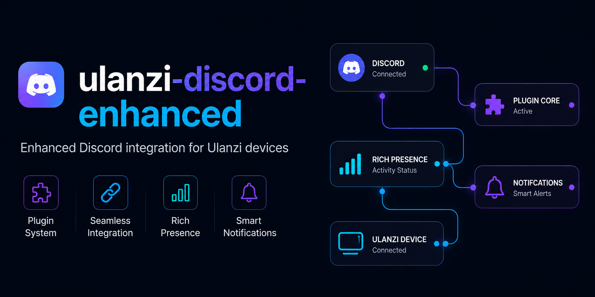

<p align="center">
  
</p>

<h1 align="center">Discord Enhanced for Ulanzi D200</h1>

<p align="center">
  <strong>Control Discord voice, channels, notifications and Soundboard from your Ulanzi Deck.</strong>
</p>

<p align="center">
  
  
  
  
</p>

---

## Overview

Discord Enhanced turns the Ulanzi D200 into a compact Discord control surface. It communicates with Discord Desktop through local RPC and keeps credentials on the local computer.

This repository is a public distribution package. It contains the final `com.buzs.discord.ulanziPlugin` folder for review and the ZIP used for installation. It does not include the private TypeScript source code.

Discord Enhanced is not affiliated with, endorsed by, or sponsored by Discord Inc. Discord trademarks and branding belong to Discord Inc.

## Features

- Microphone mute, deafen and voice input mode controls.
- Push-to-mute and push-to-talk actions for held keys.
- Camera and screen-share toggles when supported by the Discord client.
- Voice and text channel shortcuts configured from the action settings panel.
- Input/output device selection and volume controls, including encoder actions.
- Per-user voice volume control.
- Notifications action that opens the latest notification channel.
- Soundboard browser with server and sound autocomplete.
- Server statistics for voice users and RPC online status.
- Localized inspector and bundled setup guide in English, German, Spanish, Japanese, Korean, Brazilian Portuguese, European Portuguese, Simplified Chinese and Traditional Chinese.

## Requirements

- Ulanzi D200 with Ulanzi software 2.1.0 or newer.
- Windows 10 or newer, or macOS 10.11 or newer.
- Discord Desktop installed and running.
- A Discord Developer application with RPC access.

## Discord RPC Access

Discord restricts RPC applications that are not approved. During development, Discord limits access to the application's tester list. The plugin cannot bypass that restriction.

For a public release usable by people outside a tester list, the Discord application used by the publisher must be approved by Discord. A public Client Secret is not a solution: OAuth token exchange requires the secret, and distributing it would let anyone copy the credential. This plugin intentionally asks each user for their own Client ID and Client Secret instead of shipping a secret.

## Install From Release

Download the ZIP asset from the latest GitHub Release:

```text
com.buzs.discord.ulanziPlugin.zip
```

Import that ZIP in the Ulanzi software. End users do not need to run `npm install` for normal installation.

Do not install GitHub's automatically generated source code archives. Use the `.ulanziPlugin.zip` file attached to the release.

## Setup

The plugin includes a local setup guide. Open any Discord Enhanced action settings panel and click `Open local setup guide`.

Quick setup:

1. Open the [Discord Developer Portal](https://discord.com/developers/applications) and create an application.
2. Open OAuth2 and add exactly `http://localhost:30910` as a redirect URI.
3. Copy the application's Client ID and current Client Secret.
4. If the application is not approved for RPC, add the users who will test it in the Developer Portal.
5. Open any Discord Enhanced action settings panel in Ulanzi and click `Connect`.
6. Paste the credentials, approve the Discord prompt and keep Discord Desktop open.

The official Ulanzi walkthrough is available at [Create Discord Client ID and Client Secret](https://www.ulanzistudio.com/doc/discord_en). The bundled guide remains available offline after installation.

The plugin requests the private `rpc.video.*` and `rpc.screenshare.*` scopes required by the camera and screen-share actions. Discord may require application approval and can change the behavior of these private permissions.

## Actions

| Action                  | Controller | What it does                                                                            |
| ----------------------- | ---------- | --------------------------------------------------------------------------------------- |
| Mute                    | Keypad     | Toggles the Discord microphone mute state.                                              |
| Push To Mute            | Keypad     | Holds microphone mute while the key is held and restores the previous state on release. |
| Push To Talk            | Keypad     | Uses Discord push-to-talk while the key is held, with a mute fallback.                  |
| Deafen                  | Keypad     | Toggles self-deafen.                                                                    |
| Toggle Video            | Keypad     | Toggles the camera when supported by the connected Discord client.                      |
| Toggle Screen Share     | Keypad     | Toggles screen sharing when supported by the connected Discord client.                  |
| Voice Channel           | Keypad     | Joins or leaves the configured voice channel.                                           |
| Text Channel            | Keypad     | Opens the configured text channel in Discord.                                           |
| Set Audio Device        | Keypad     | Sets the configured input/output device.                                                |
| Voice Input Mode Toggle | Keypad     | Switches between voice activity and push-to-talk.                                       |
| Volume Control          | Encoder    | Presses/rotates to control configured input or output volume.                           |
| User Voice Control      | Encoder    | Controls a configured user's voice volume.                                              |
| Notifications           | Keypad     | Opens the latest Discord notification channel.                                          |
| Soundboard              | Keypad     | Plays a configured Discord Soundboard sound.                                            |
| Server Stats            | Keypad     | Displays voice user count or RPC online count for a server.                             |
| Mute Control            | Encoder    | Press toggles mute; rotate adjusts input volume.                                        |
| Deafen Control          | Encoder    | Press toggles deafen; rotate adjusts output volume.                                     |

## Settings Panel

The settings panel shows the live Discord connection state and offers:

- `Confirm` to save the action settings.
- `Change app` to try another Client ID/Secret without losing the current connection if the new credentials fail.
- `Setup guide` to open the bundled offline guide.
- `Disconnect` to remove the saved credentials from this computer.

If Discord is closed, reopen it and use the action again. If credentials were rotated, use `Change app` and paste the current secret.

## Privacy And Local Data

The plugin starts a local HTTP server bound to `127.0.0.1` for the settings panel and stores runtime data inside the installed plugin folder:

```text
com.buzs.discord.ulanziPlugin/.data/index.json
```

The file contains the local server port, an internal inspector token and encrypted Discord credentials. The Client Secret is encrypted with AES-256-GCM using a key derived from the local machine and plugin UUID. This protects the file at rest from casual inspection, not from malware or a process already running as the same user.

The plugin communicates with Discord Desktop over local IPC or the legacy localhost RPC fallback, and with `discord.com` only during OAuth token exchange.

## Troubleshooting

- `invalid_client`: verify that the Client ID and Client Secret belong to the same Discord application, and reset the secret if it was rotated.
- RPC access denied: approve the application or add the Discord account to its tester list.
- Redirect URI mismatch: add exactly `http://localhost:30910` in OAuth2.
- Discord is not running: fully restart Discord Desktop and try the action again.
- Camera or screen share fails: those actions rely on private RPC commands that may vary by Discord client version.
- Soundboard fails: restart Discord and refresh the sound list; Soundboard RPC commands are not part of the stable public RPC surface.

## Repository Layout

```text
.
├── CHANGELOG.md
├── LICENSE
├── README.md
└── com.buzs.discord.ulanziPlugin/
    ├── manifest.json
    ├── package.json
    ├── plugin/
    ├── property-inspectors/
    └── resources/
```

## License

Discord Enhanced is distributed here as a built Ulanzi plugin package. The real source code is private and is not licensed as part of this public distribution.

Third-party dependencies keep their own licenses. Ulanzi SDK/runtime files and Discord services belong to their respective owners.
